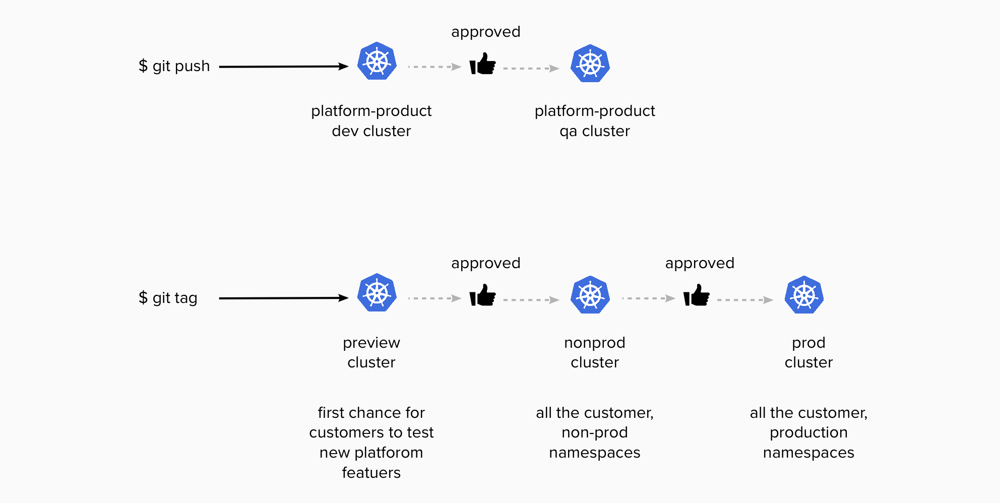

<div align="center">
	<p>
		
    <br />
		
	</p>
  <h4>circlepipe documentation</h4>
</div>
<br />

## 3 multi-environment pipeline definition file

The pipeline definition file defines all the pipelines you want to be able to generate from within the base pipeline of a repository. The definition of a pipeline is built around an ordered list of the environments you want to deploy and the list of all the instances of the environment.  

Once utilized, this control file becomes a shared dependency among those repositories and pipelines that depend on the global settings contained therein. An effective practice is to store this file in your secrets management tool so that it can referenced by any other pipeline as needed. Generally though, any storage location accessible by your pipelines can be used to host the file.

#### 3.1 Pipelines and triggers

Suppose you are part of an Engineering Platform product team where the compute feature is built around kubernetes, and you are using AWS and EKS as part of delivering this platform. For a quality, enterprise level platform this results in a k8s release pipeline that would look something like this:



Developer-users (customers) of the platform will have namespaces in the preview, nonprod, and prod clusters. However, when evolving to support multi-regional compute definition, the platform team will now need to have preview, nonprod, and prod clusters in multiple regions around the world. Hence a kuberneset change to _preview_ now means a change to many clusters rather than a single instace.

`git push`  is still expected to result in deployments to all of the product test environments and `git tag` still deploys changes to all the customer-facing clusters. Depending on the trigger, there are two different pipelines that could need to be generated.  

Using yaml, let's start by defining the two possible pipelines and the associated triggers<sup>1</sup>:
```yaml
---
test:
  filter: "*on-push-main"
release:
  filter: "*on-tag-main"
```
The test pipeline is triggered by git push, the release pipeline by git tag. (A typical trunk-based development pattern.)  

#### 3.2 Ordered list of Deployment

Next we add the ordered list of cluster _environments_ we want to deploy:
```yaml
---
test:
  filter: "*on-push-main"
  deploy:
    - platform-dev
    - platform-qa
release:
  filter: "*on-tag-main"
  deploy:
    - preview
    - nonprod
    - prod
```
These lists mean that when the `test` pipeline is generated we want it to first deploy the platform-dev clusters and then the platform-qa clusters. In an engineering platform, these are not clusters that regular users of the platform would ever use. These are used by the platform product team to develop and test new platform featues before releasing them to the users (customers).

When we tag a release candidate, we want the pipeline to deploy the changes to the preview EKS clusters, then nonprod clusters, and finally the prod clusters, in that order. In this definition file, these _environments_ now represent groups of similarly configured infrastructure environments located in multiple regions rather than a single instance. The circlepipe tool refers to theses as **roles**. In other words, the _preview_ role represents multiple instances of EKS clusters whose shared _role_ is that of Preview. (In this case Preview is meant to be the environment in which customers of the platform have a chance to test new platform features before they are released to the regular environments. This is particularly useful in providing advance warning of a new feature that will break existing deployments.)

#### 3.3 Roles to deploy

Next, we want to describe the roles. Let's assume for this example that each role will need four clusters in four different regions in north America and Europe. For the _Test_ pipeline we can limit these to just two regions:
```yaml
---
test:
  filter: "*on-push-main"
  deploy:
    - platform-dev
    - platform-qa
  roles:
    platform-dev:
      deploy:
        - platform-dev-us-west-2
        - platform-dev-eu-west-1
    platform-qa:
      deploy:
        - platform-qa-us-west-2
        - platform-qa-eu-west-1
release:
  filter: "*on-tag-main"
  deploy:
    - preview
    - nonprod
    - prod
  roles:
    preview:
      deploy:
        - preview-dev-us-west-2
        - preview-dev-us-east-1
        - platform-dev-eu-west-1
        - preview-dev-eu-central-1
    nonprod:
      deploy:
        - nonprod-dev-us-west-2
        - nonprod-dev-us-east-1
        - nonprod-dev-eu-west-1
        - nonprod-dev-eu-central-1
    prod:
      deploy:
        - prod-dev-us-west-2
        - prod-dev-us-east-1
        - prod-dev-eu-west-1
        - prod-dev-eu-central-1

```

#### 3.4 Instances within the roles

Finally, each of the regions within the _role_ will be refered to as an **instance**. We can associated a set of key/value pairs with each instance that can be referenced when generating the pipeline. In actual use cases, since these _instances_ generally represent cloud provider Regions, the information we want to maintain is the region and provider account (or project or whatever construct is used by the provider). Let's add that information to our example:
```yaml
---
test:
  filter: "*on-push-main"
  deploy:
    - platform-dev
    - platform-qa
  roles:
    platform-dev:
      deploy:
        - platform-dev-us-west-2
        - platform-dev-eu-west-1
      instances:
        platform-dev-us-west-2:
          aws_region: us-west-2
          aws_account_id: '10100000000'
        platform-dev-eu-west-1:
          aws_region: eu-west-1
          aws_account_id: '10100000000'
    platform-qa:
      deploy:
        - platform-qa-us-west-2
        - platform-qa-eu-west-1
      instances:
        platform-qa-us-west-2:
          aws_region: us-west-2
          aws_account_id: '10100000000'
        platform-qa-eu-west-1:
          aws_region: eu-west-1
          aws_account_id: '10100000000'
release:
  filter: "*on-tag-main"
  deploy:
    - preview
    - nonprod
    - prod
  roles:
    preview:
      deploy:
        - preview-us-west-2
        - preview-us-east-2
        - preview-eu-west-1
        - preview-eu-central-1
      instances:
        preview-us-west-2:
          from_generate_aws_region: us-west-2
          from_generate_aws_account_id: '20100000000'
        preview-us-east-2:
          from_generate_aws_region: us-east-2
          from_generate_aws_account_id: '20100000000'
        preview-eu-west-1:
          from_generate_aws_region: eu-west-1
          from_generate_aws_account_id: '20100000000'
        preview-eu-central-1:
          from_generate_aws_region: eu-central-1
          from_generate_aws_account_id: '20100000000'
    nonprod:
      deploy:
        - nonprod-us-west-2
        - nonprod-us-east-2
        - nonprod-eu-west-1
        - nonprod-eu-central-1
      instances:
        nonprod-us-west-2:
          from_generate_aws_region: us-west-2
          from_generate_aws_account_id: '20100000000'
        nonprod-us-east-2:
          from_generate_aws_region: us-east-2
          from_generate_aws_account_id: '20100000000'
        nonprod-eu-west-1:
          from_generate_aws_region: eu-west-1
          from_generate_aws_account_id: '20100000000'
        nonprod-eu-central-1:
          from_generate_aws_region: eu-central-1
          from_generate_aws_account_id: '20100000000'
    prod:
      deploy:
        - prod-us-west-2
        - prod-us-east-2
        - prod-eu-west-1
        - prod-eu-central-1
      instances:
        prod-us-west-2:
          from_generate_aws_region: us-west-1
          from_generate_aws_account_id: '30100000000'
        prod-us-east-2:
          from_generate_aws_region: us-east-1
          from_generate_aws_account_id: '30100000000'
        prod-eu-west-1:
          from_generate_aws_region: eu-west-1
          from_generate_aws_account_id: '30100000000'
        prod-eu-central-1:
          from_generate_aws_region: eu-central-1
          from_generate_aws_account_id: '30100000000'
```
Now we have a complete pipeline definition.  

There are two pipelines defined, though we can define as many types of triggers as we want and therefore could have equally many pipelines in our definition, if called for by the situation.  

We have defined the order of deployment of our desired _roles_.  

For each _role_ we have specified the number of _instances_ of the infrastructure or application definition that make up the role as well as the order of deployment for the instances; though that does not typically matter and is more in anticipation of possible future changes to the tool.

#### 3.5 Summary (definitions)


**generate.yaml**. The default name for the pipeline control definition file. The control file contains the definitions used by circlepipe to generate a pipeline from the existing config.yml and the provided pipeline templates. The file format is assumed to be yaml by default and json is also supported. (See [Pipelines](./pipelines.md)).

_contents of generate.yaml file_.

The top level keys in the file are the pipelines.  

A pipeline must always have the following three keys:  
- filter: any valid circleci filter definition
- deploy: An ordered list of the Roles to be deployed by the pipeline.
- roles: The definition of each role in the deploy list

**Role**. These are analogous to environments in the usual deployment pipeline layout. The term Role is adopted to indicate that a given role is actually made up of any number of similar configured instances of an environment.  

Following a key named "role:" should be keys for each role in the deploy list (must match exactly). A role definition will always have the following two keys:  
- deploy: An ordered list of the Instances that make up the Role.
- instances: The definition of each Instance in the role deploy list.

**Instance**. What is an instance? Refering back to the example above, if I use terraform to configure EKS and I have four regions that make up Production (meaning four distinct EKS clusters) then what I need to have happen when deploying a configuration change is to run the plan-step against all four, and subsequently if I approve the plans then I need the apply-step to also happen to all four clusters. Naturally, if I support many regions in production I will need to likewise have those regions in my other roles (nonproduction). But for however many roles I have, each is going to have multiple instance of a baseline configuration. In the case of an EKS infrastructure pipeline this means multiple instance of EKS.

This could also apply in a multi-region application deployment context as well. For instance, as the administrative manager of the above cluster, I am likely deploying cluster-wide services such as metrics-server. I could choose to manage this deploy using helm and in the above situation this would mean that when deploying (or later upgrading) this service a 'deployment' to production (or any of the roles) likewise means deploying to four distinct clusters. Circlepipe allows me to define what a deployment means just once and then automatically generate the pipeline jobs for each location.  

Therefore an Instance contains keys matching the instances defined in the role deploy list. Associated with the instance can then be any number of key:value pairs that you want to define. Generally speaking however, this list sholud be limited to attributes that are common to all instances. In the above example, this is just the aws account and region. But you can add any "key": "value" pairs that you want.


**footnotes**

<sup>1</sup>In the example below, the "\*on-push-main" and "\*on-tag-main" aliases refers to a specific anchor definition in yaml for circleci that looks like this
```yaml
on-push-main: &on-push-main
  branches:
    only: /main/
  tags:
    ignore: /.*/

on-tag-main: &on-tag-main
  branches:
    ignore: /.*/
  tags:
    only: /.*/
```
These anchors would need to be in your base config.yml. Naturally you can define these trigers however you want in the context of your pipeline.  

<hr>  

[<kbd> <br> Back <br> </kbd>](./table_of_contents.md)
